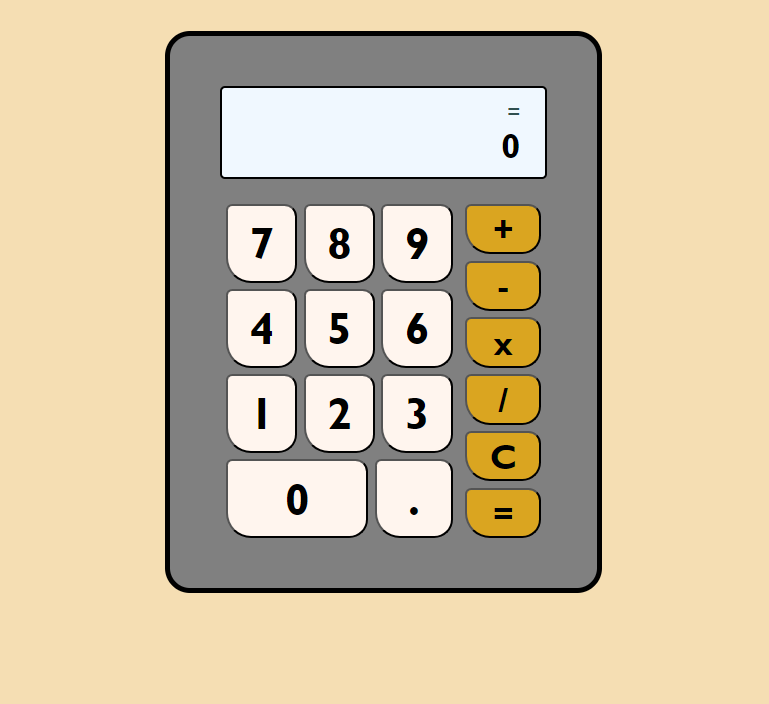

# Odin Calculator

> A calculator application for The Odin Project

A simple calculator application that allows addition, subtraction, multiplication and division operations.

## Built With

- HTML5
- CSS3
- JavaScript

## Live Demo

[Live Demo Link](https://danielfinx.github.io/odin_calculator/)

## Getting Started

**This is an example of how you may give instructions on setting up your project locally.**
**Modify this file to match your project, remove sections that don't apply. For example: delete the testing section if the currect project doesn't require testing.**

To get a local copy up and running follow these simple example steps.

### Prerequisites

### Setup

### Install

### Usage

### Run tests

### Deployment

## Authors

👤 **Daniel Enrique Santander Finol**

- GitHub: [@Danielfinx](https://github.com/Danielfinx)
- LinkedIn: [LinkedIn](https://www.linkedin.com/in/daniel-santander-ab260b228/)
- Twitter: [@Daniel](#)

👤 **Author2**

- GitHub: [@githubhandle](https://github.com/githubhandle)
- Twitter: [@twitterhandle](https://twitter.com/twitterhandle)
- LinkedIn: [LinkedIn](https://linkedin.com/linkedinhandle)

## 🤝 Contributing

Contributions, issues, and feature requests are welcome!

Feel free to check the [issues page](issues/).

## Show your support

Give a ⭐️ if you like this project!

## Acknowledgments

- Hat tip to anyone whose code was used
- Inspiration
- etc

## 📝 License

This project is [CC0 1.0 Universal](LICENSE) licensed.
